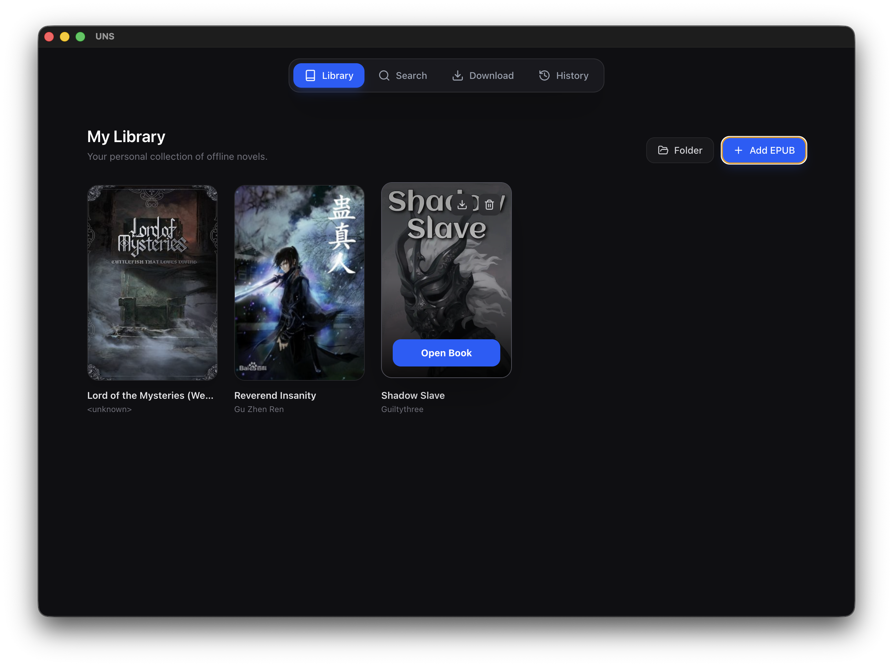
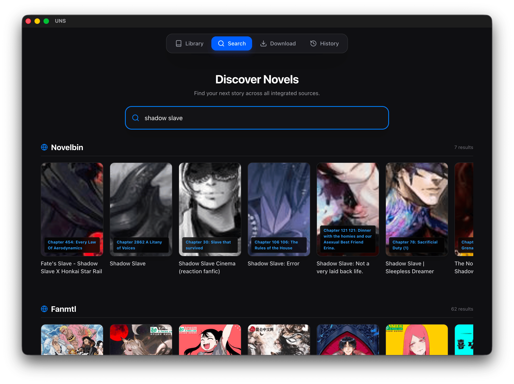
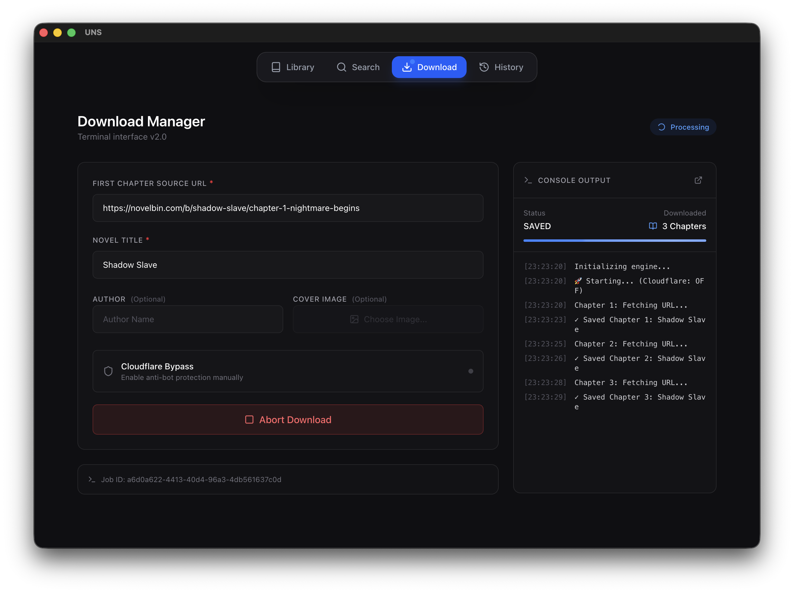
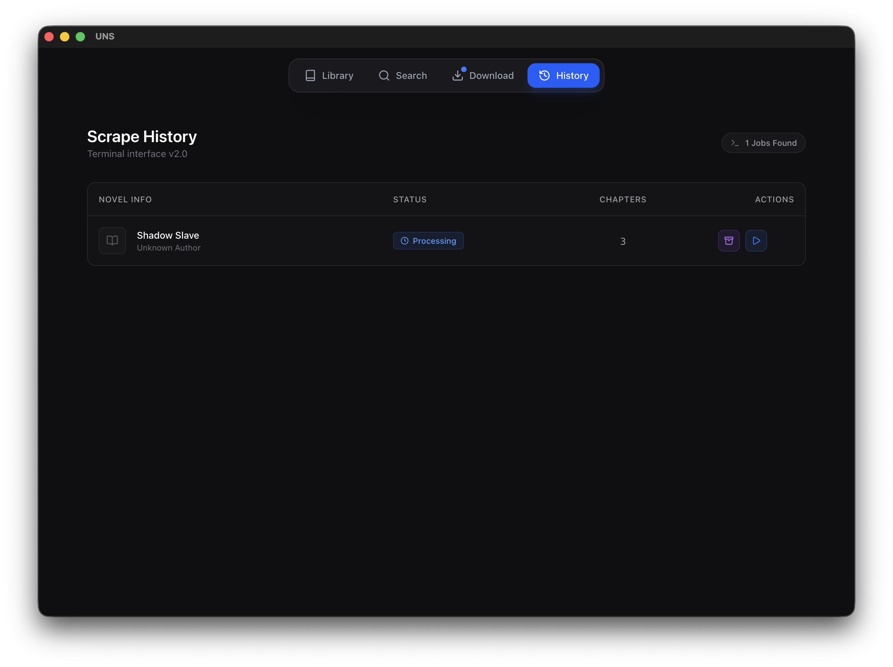

# 📖 Universal Novel Scraper (UNS)

<p align="center">
  
  
  
  
  
</p>

> A high-performance desktop application designed to **scrape web novels chapter-by-chapter** and package them into professionally formatted **EPUB books**.

The project uses **Electron’s built-in Chromium browser** to scrape pages like a real user, bypassing most bot protections (including Cloudflare), while a **Python FastAPI sidecar** handles EPUB generation, state management, and file processing.

---

### 📥 Download Latest Release

<div align="center">

<table>
  <thead>
    <tr>
      <th align="center">Windows</th>
      <th align="center">macOS</th>
      <th align="center">Linux</th>
    </tr>
  </thead>
  <tbody>
    <tr>
      <td align="center">
        <a href="https://github.com/OsamaTab/UNS/releases/latest">
          
        </a>
      </td>
      <td align="center">
        <a href="https://github.com/OsamaTab/UNS/releases/latest">
          
        </a>
      </td>
      <td align="center">
        <a href="https://github.com/OsamaTab/UNS/releases/latest">
          
        </a>
      </td>
    </tr>
  </tbody>
</table>

</div>

---

# 📑 Table of Contents

- [Screenshots](#-screenshots)
- [Overview](#-overview)
- [Features](#-features)
- [Architecture](#-architecture)
- [Project Structure](#-project-structure)
- [Installation](#-installation)
- [Running the App](#-running-the-app)
- [Building the Python Engine](#-building-the-python-engine)
- [Scraping Flow](#-scraping-flow)
- [Backend API](#-backend-api)
- [Troubleshooting](#-troubleshooting)
- [Roadmap](#-roadmap)
- [License](#-license)

---

# 📸 Screenshots



*Browse previously downloaded EPUBs with automatic cover extraction..*



*it will allow you to search from multiple novel sites and you can choose to download from anywhere you want*



*The Download Manager featuring live console output, progress tracking, and manual Cloudflare bypass.*



*The integrated Library and History views with dynamic cover extraction and EPUB management.*

---

# 🎯 Overview

The **Universal Novel Scraper** allows users to archive web novels directly from supported websites and convert them into fully formatted **EPUB books**.

Instead of using traditional scraping frameworks that are easily detected, this application uses a **human-like browser session** controlled by Electron.

This design allows the program to:

- Avoid bot detection
- Handle Cloudflare challenges
- Maintain browsing sessions
- Scrape dynamic websites reliably

The scraped content is processed by a **Python backend** that structures chapters and compiles them into valid EPUB files.

---

# ✨ Features

### 📥 Download Manager

- Chapter-by-chapter scraping
- Progress tracking
- Resume interrupted downloads
- Manual Cloudflare bypass option

### 📚 Library Manager

- View downloaded EPUBs
- Extract and display cover images
- Manage book collection
- Delete or re-export EPUB files

### 🖥 Desktop Experience

- Built with **Electron**
- Dark UI using **Tailwind CSS**
- Cross-platform support

### 📦 EPUB Generation

- Clean chapter formatting
- Metadata support
- Embedded cover images
- EPUB standards compliant

---


# 🏗 Architecture

The application uses a **Sidecar Architecture Pattern**.

```
React UI
   │
   │ IPC
   ▼
Electron Main Process
   │
   │ Controls Browser
   ▼
Chromium BrowserWindow
   │
   │ Extracts page content
   ▼
Python FastAPI Engine
   │
   ▼
EPUB Generator
```

### Responsibilities

**React Frontend**

- UI
- Download manager
- Library interface
- Log viewer

**Electron**

- Controls Chromium browser
- Executes DOM extraction scripts
- Manages Python engine lifecycle
- IPC communication

**Python FastAPI Sidecar**

- Stores scraped chapters
- Tracks download progress
- Builds EPUB files
- Serves library data

---

# 📂 Project Structure

```plaintext
NOVEL-SCRAPER/
├── main.js
├── preload.js
├── package.json

├── backend/
│   ├── api.py
│   ├── requirements.txt
│   └── dist/
│       └── engine

└── frontend/
    ├── index.html
    ├── vite.config.js

    └── src/
        ├── App.jsx
        ├── components/
        │   └── Navigation.jsx
        └── pages/
            ├── Download.jsx
            ├── History.jsx
            └── Library.jsx
```

---

# 📦 Installation

## Prerequisites

- **Node.js 18+**
- **Python 3.11+**

### macOS (Apple Silicon)

Install developer tools:

```bash
xcode-select --install
```

---

## Clone Repository

```bash
git clone https://github.com/your-username/novel-scraper.git
cd novel-scraper
```

---

## Install Frontend Dependencies

```bash
npm install
```

---

## Setup Python Backend

```bash
cd backend

python -m venv venv

source venv/bin/activate
# Windows
venv\Scripts\activate

pip install -r requirements.txt
```

---

# ▶ Running the App (Development)

From the root directory:

```bash
npm run dev
```

This will:

1. Start Electron
2. Launch the Python engine
3. Open the React interface

---

# 🛠 Building the Python Engine

The Python backend must be compiled into a standalone binary for Electron.

```bash
cd backend

python -m PyInstaller \
  --onefile \
  --windowed \
  --name engine \
  api.py
```

Output binary:

```
backend/dist/engine
```

Electron loads the engine from:

| Environment | Path |
|-------------|------|
| Development | backend/dist/engine |
| Production | process.resourcesPath/bin/engine |

---

# 🔄 Scraping Flow

1. User enters novel URL
2. React sends job data via IPC
3. Electron opens a Chromium browser window
4. Page loads normally
5. JavaScript extraction runs in DOM
6. Data extracted:
   - Title
   - Paragraphs
   - Next chapter URL
7. Data sent to Python API
8. Python saves chapter data
9. Loop continues until final chapter
10. EPUB file is generated

---

# 🐍 Backend API

### `/api/save-chapter`

Stores chapter text and updates download progress.

---

### `/api/finalize-epub`

Compiles all chapters into an EPUB using **ebooklib**.

Includes:

- Title
- Author
- Metadata
- Cover image

---

### `/api/cover/{filename}`

Extracts cover image from EPUB for the Library UI.

---

### `/api/library/{filename}`

Allows deletion or export of stored EPUB files.

---

# 🚧 Troubleshooting

### Engine Not Starting (macOS)

Make the binary executable:

```bash
chmod +x ./backend/dist/engine
```

---

### PyInstaller Import Errors

Ensure PyInstaller was executed **inside the virtual environment** containing:

- fastapi
- uvicorn
- ebooklib

---

# 🛣 Roadmap

### Completed

- Electron-native scraper
- React download manager
- Library manager
- EPUB generation
- Resume downloads

### Planned

- Regex-based ad cleaner
- Multi-format exports (PDF, MOBI)
- Built-in EPUB reader
- Site-specific scraping plugins
- Automatic chapter detection

---

# ⚖️ License

Copyright (c) 2026 Osama

Licensed under:

**Creative Commons Attribution-NonCommercial 4.0**

https://creativecommons.org/licenses/by-nc/4.0/

### Summary

✅ Personal use allowed  
✅ Modifications allowed with attribution  
❌ Commercial use prohibited

For commercial licensing inquiries, contact via GitHub.